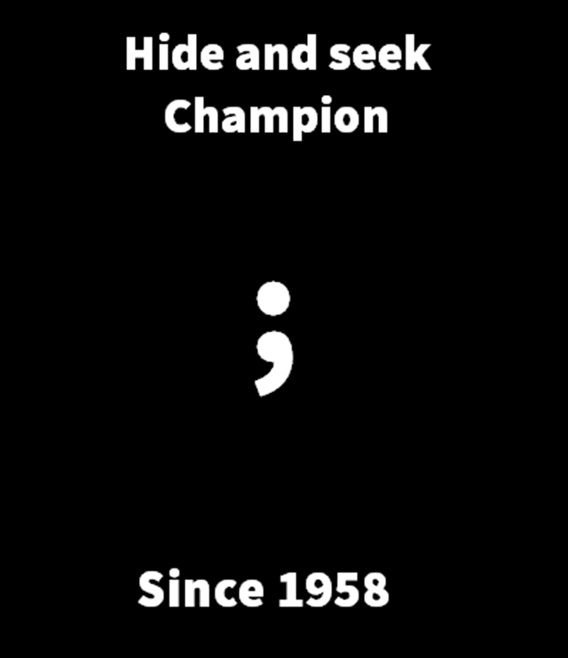

Aloha~ udah lama banget ternyata belum nge-post lagi~

akhirnya baru kesampean diwaktu kosong kemarin gue nyempetin untuk mengintegrasi blog gue ini pakai ReactJS. ga cuma
karena penasaran, tapi sekalian mau ganti tampilan juga. ihiy. karena bingung mau nambahin basa-basi apaan lagi, mending
langsung bahas agak teknis aja deh 😂

ingredients atau bahan-bahan utama yang gue pake ada [ReactJS](https://facebook.github.io/react/) tentunya,
[Mobx](https://mobxjs.github.io/mobx/) untuk state-management, dan
[WordPress Rest API](https://wordpress.org/plugins/json-rest-api/) yang menyediakan API-nya. pengalaman/cerita
detailnya, akan gue jabarkan di poin-poin berikut ini:

## no more semicolon for Javascript

saat gue ngoding ini, gue mencoba untuk tidak pakai titik-koma ‘;’ pada setiap akhir argumen di Javascript. karena pada
dasarnya Javascript emang bisa tanpa titik-koma, beda kaya bahasa pemrograman seperti PHP, C#, Java atau lainnya. yang
gue tau sih sama kaya Python sama Ruby yang ga perlu pakai titik-koma. awalnya sih gara-gara video ini
[Are Semicolons Necessary in JavaScript?](https://www.youtube.com/watch?v=gsfbh17Ax9I "Are Semicolons Necessary in JavaScript?")
tapi setelah nyobain, gue malah lebih suka ga pake titik-koma loh, dan terlihat lebih bersih juga.

i’m happy with this, goodbye semicolons

## hello 2 space indentation

biasanya gue ngoding selalu pakai 4 space indentation, tapi karena sering ngeliatin kode orang-orang di Github pada
pakai 2 space yaudah gue ikutin juga. karena kalo nanti mau bantu kontribusi di proyek open source juga mesti ngikutin
style guide-nya mereka. klo ini ga terlalu berasa sih bedanya, jadi mulai sekarang mau biasain pakai 2 space deh.

## Mobx as state management

gue pernah ngebuat single page application pake ReactJS yang skalanya terbilang small-medium, waktu itu gue masih pakai
state management-nya bawaan React. pengalaman sih, semakin gede dan semakin banyak Nested Component-nya makin ribet klo
pake state bawaan React. karena waktu itu belum tau tentang [Flux](https://facebook.github.io/flux/),
[Redux](https://redux.js.org/), dan [Mobx](https://mobxjs.github.io/mobx/). gue belum pernah pakai Flux sih, tapi
menurut gue paling gampang dipelajarin itu Mobx, kedua Redux.

## what is that ugly url?

karena sebelumnya gue install wordpress-nya langsung di directory /public_html jadinya file index.html yang sekarang
berdampingan sama file index.php-nya empunya wordpress. jadinya, untuk react-router nya gue pakai {hashHistory} efeknya
adalah klo buka web gue yang sekarang ada tambahan hash dan random string dibelakangnya semacam ‘#/?_k=0ab10a’. karena
klo gue ga pakai hash, setiap ada yang direct visit ke web gue dengan url
[https://preschian.com/serba-online](https://preschian.com/serba-online) bakalan ke halaman php wordpressnya, dengan
bantuan .htaccess gue bisa direct ke file html-nya https://preschian.com/#/serba-online. mestinya sih wordpress-nya gue
pindahin dulu misal ke direktori cms dengan subdomain cms.preschian.com/wp-admin klo mau nambah post, klo untuk yang
sekarang kan gue tetep bisa nambah post dari preschian.com/wp-admin. klo udah dipindah, setting lagi .htaccess-nya baru
bisa clean deh url-nya.

## nice to have

ada beberapa fitur yang masih belum gue adain, contohnya kaya fitur komen ini masih belum gue buat. karena untuk user
interface-nya juga belum kepikiran.

## wordpress api so slow

gue belum tau kenapa wordpress api ini menurut gue lama banget, fetch data-nya aja bisa sampe lebih dari 1 detik.
padahal udah pake WP REST API Cache juga tapi ga terlalu ngefek. awalnya malah gue nyoba
[official api-nya wordpress](https://developer.wordpress.com/docs/api/) tapi malah lebih lama lagi. gue rasa sih klo mau
optimasi mesti ditempatin server yang oke dan perlu ngoding php-nya juga, mungkin bisa dioptimasi lagi plugin-nya.
karena gue ogah untuk ngoding php, gue lebih milih alternatif lain. cara lainnya adalah buat script javascript untuk
pindahin semua postingan dari wordpress ke firebase, terus sambungin wordpress dengan firebase pakai
[https://zapier.com/](https://zapier.com/), jadi kedepannya setiap nambah post nambah juga data di firebase. nah,
aplikasi-nya berkomunikasi sama data yang di firebase aja. kan [Firebase](https://www.firebase.com/) cepet tuh. itu sih
alternatif lain yang menurut gue lebih possible.

mau nambahin fitur-fitur yang belum, tapi udah kepikiran aja ngoding iseng selanjutnya. hadeh hadeh 😂 blog pribadi mah
gampanglah ya, lanjut buat iseng yang lain aja kayanya 😂
