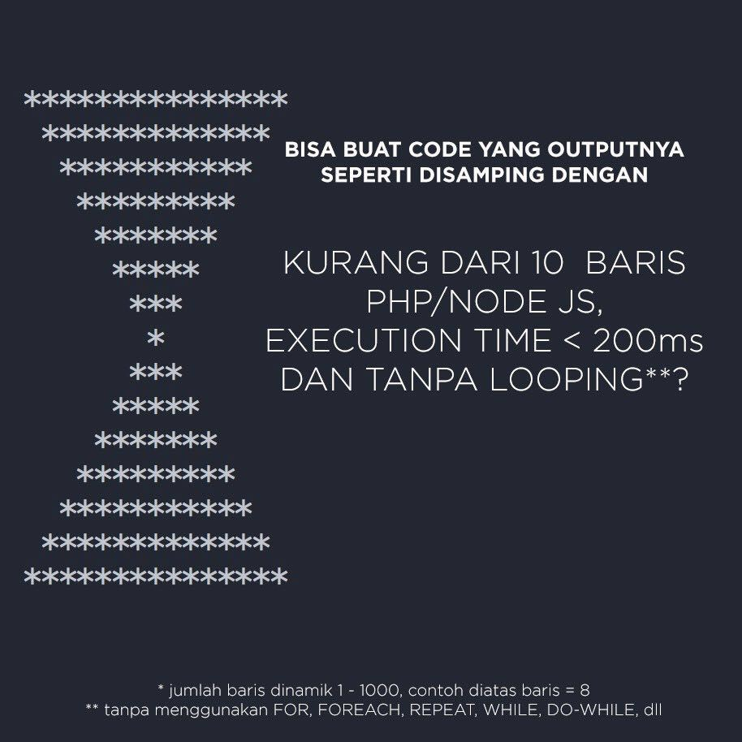
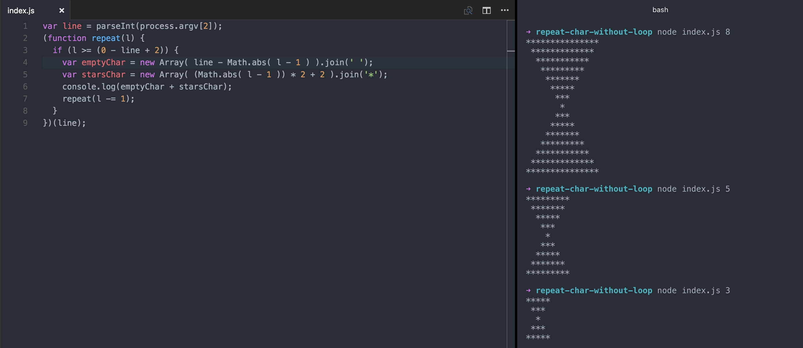

Hola hola~ Gue ikut group banyak banget di Whatsapp ataupun di Line, mulai dari group temen SMA sampe temen-temen yang
pernah sekantor. Tapi, walaupun ikut banyak group ga bakal pernah gue baca semua isi chatnya. Lagipula, gue tipe orang
yang nge-chat orang klo ada perlu doang, jarang chat buat ngobrol basa-basi, hahaha.

Ada satu group yang lagi sering gue bacain chat-nya, dan ada satu hal yang menurut gue menarik. Gara-gara ada satu orang
yang share gambar ini, gue jadi merasa tertantang dan penasaran.

Gue penasaran karena, dari dulu awal gue belajar programming sampe kelar sekolah dan ngelamar kerja klo nemu soal
semacam gini pasti disuruhnya pake pengulangan. Biasanya pake looping FOR, WHILE, atau semacamnya. Nah di soal kali ini
katanya gak boleh pake function pengulangan, nahloh gimana tuh.

Gue merasa tertantang karena, di gambar tersebut ada tulisan NODE JS yang secara basic adalah bahasa javascript. Ga cuma
itu aja, gue klo ngelamar kerja dan dites tentang algoritma yang mungkin gampang pasti ga bisa jawab/ngoding langsung di
tempat alhasil ga diterima deh. Misalnya disuruh ngoding yang output-nya deret Fibbonaci, atau yang output-nya kata-kata
yang munculnya hanya sekali dari suatu kalimat, atau buat class untuk tic-tac-toe, atau output-nya bintang-bintang (\*)
yang ngebentuk segitiga mirip kaya gambar di atas hanya saja cuma satu segitiga aja, klo di atas kan dua segitiga.

Nah, karena sekarang lagi ga ngelamar kerjaan, apalagi ga ada deadline buat nyeleseinnya gue dengan senang hati buat
mengerjakan soalnya. Lagipula lagi nyantai juga lumayan buat ngasah.

Sore gue dapet gambarnya, pulang, belom makan, ga ngabarin pacar juga, saking penasarannya 😂.
Akhirnya pas malemnya gue bisa juga memecahkan soalnya. Wah, seneng banget rasanya waktu itu. LUL. Langsung makan deh
terus bobo nyenyak sampe kesiangan. Hahaha.

Nah, gambar di atas kode gue untuk output tersebut. Gue juga ga tau bener apa enggak, tapi klo dari input dan output
udah sesuai sama soalnya. Tapi gue masih sedikit penasaran untuk line 4 sama 5, gue rasa bagian tersebut bisa dibikin
simpel lagi. Cuma, gue belum tau harus digimanain lagi. Karena vocabulary gue tentang Javascript masih belum banyak.

Kesimpulan yang gue dapet adalah, algoritma aja ga cukup, klo mau lebih bagus atau mungkin lebih efisien lagi harus
kenal sama metode-metode lainnya, dan vocabulary atau function bawaan dari setiap bahasa yang sedang kita dalami juga
harus diperbanyak.

Fiuh, cukup sekian. Mungkin ada yang udah expert Javascript dan baca tulisan ini dan punya jawaban yang lebih simpel mau
dong dikasih tau. Bisa komen di
[gist saya](https://gist.github.com/preschian/dfd3ba8ad7dc174340257837f627ef6f)
😬👍

Tech me senpai~
