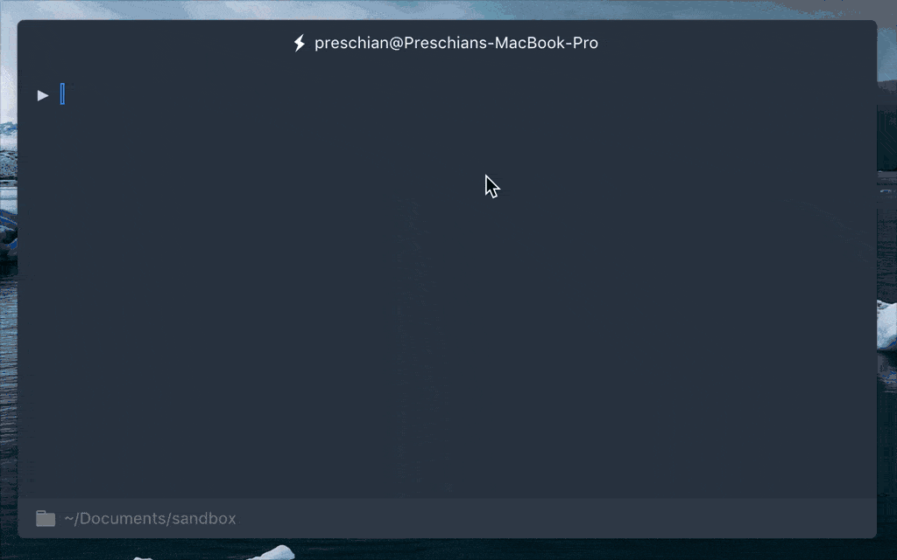

Tahun baruan kemarin gue baru tahu yang namanya Zsh, karena sebelumnya sempet ngeliat dan kepengen pake
[zsh-auto-suggestions](https://github.com/zsh-users/zsh-autosuggestions/blob/master/README.md) untuk terminal. Yaudah
langsung gugling deh untuk [install zsh](https://github.com/robbyrussell/oh-my-zsh/wiki/Installing-ZSH)-nya dulu. Klo
yang pake macOS ketik:

```bash
brew install zsh zsh-completions
```

Intruksi lengkapnya ada sih di link barusan. Karena default terminal yang gue pake saat ini [Hyper](https://hyper.is/)
dari Zeit. Jadi, gue sesuaikan lagi konfigurasi-nya untuk default shell-nya ke Zsh. Inilah tema dan plugin yang gue pake
di Hyper terminal:

```bash
plugins: [
  'hyper-statusline',
  'hyperterm-chesterish'
],
shell: '/bin/zsh',
hyperStatusLine: {
  footerTransparent: false,
}
```

Di plugin yang gue pake barusan, ada status bar nampilin current directory dan klo pake git nampilin lagi di branch
mana. Karena udah ada status bar kaya gitu, konfigurasi Zsh-nya gue edit jadi kaya gini:

```bash
NEWLINE=$'\n'
export PS1="${NEWLINE}▶ "

# default directory
cd ~/Documents/sandbox/

# plugins
source ~/.zsh/zsh-autosuggestions/zsh-autosuggestions.zsh
source ~/.zsh/zsh-syntax-highlighting/zsh-syntax-highlighting.zsh

# set terminal title
DISABLE_AUTO_TITLE="true"
precmd () {print -Pn "\e]0;%n@%m\a"}
```

Nah, beginilah konfigurasi terminal gue untuk saat ini. So far, asik makenya. Belum nyari-nyari lagi plugin Zsh yang
keren.
