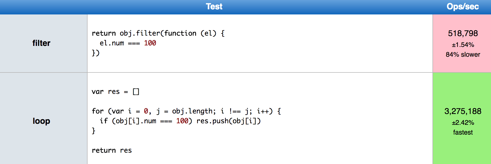

Awalnya penasaran gara-gara ngeliat tes di atas, [Array Loop vs Filter](https://jsperf.com/array-loop-vs-filter). Klo
diperhatiin sih, penggunaan filter maupun for loop di atas tujuannya sama. Menyaring object yang num-nya 100, tapi
penggunaan filter jelas lebih simpel dan ringkas dibanding for loop, jumlah barisnya aja lebih sedikit. Nah, yang bikin
gue penasaran adalah, dibagian kanan dibilangnya penggunaan for loop jauh lebih cepat dibanding penggunaan filter,
padahal lebih ribet kodingannya dibanding filter.

Karena penasaran yaudah, gue coba ngetes sendiri lewat console-nya chrome. Pertama, gue pake data dummy dari
[randomuser.me](https://randomuser.me/api/?results=5000) dengan jumlah 5000 array object. Terus, gue pake extension
chrome namanya [JSON Viewer](https://chrome.google.com/webstore/detail/json-viewer/gbmdgpbipfallnflgajpaliibnhdgobh),
dengan ekstension ini gue bisa mengakses json api-nya lewat console chrome dengan panggil variable ‘window.json’. Abis
itu seperti ini-lah kodingan yang mau gue cobain antara filter, for loop, foreach, dan for of:

```javascript
function pakaiFilter() {
  return window.json.results.filter(value => {
    return value.gender === 'male'
  })
}

function pakaiForLoop() {
  const hasil = []
  for (var i = 0; i < window.json.results.length; i++) {
    if (window.json.results[i].gender === 'male') hasil.push(window.json.results[i])
  }

  return hasil
}

function pakaiForEach() {
  const hasil = []
  window.json.results.forEach(value => {
    if (value.gender === 'male') hasil.push(value)
  })
  return hasil
}

function pakaiForOf() {
  const hasil = []
  for (let value of window.json.results) {
    if (value.gender === 'male') hasil.push(value)
  }
  return hasil
}

console.time('time filter')
pakaiFilter()
console.timeEnd('time filter')

console.time('time for loop')
pakaiForLoop()
console.timeEnd('time for loop')

console.time('time foreach')
pakaiForEach()
console.timeEnd('time foreach')

console.time('time for of')
pakaiForOf()
console.timeEnd('time for of')
```

Salin kode di atas, tempel di console chrome, tekan enter deh. Jeder, untuk hasil pertama kali adalah sebagai berikut:

* **filter: 0.956ms**
* for loop: 4.283ms
* **foreach: 0.887ms**
* **for of: 0.887ms**

Dites ini penggunaan for loop malah paling lama dibanding filter, ataupun foreach dan for of. Yaudah gue cobain lagi
sampai 5x tes, hasilnya sebagai berikut:

* **filter: 0.867ms**
* for loop: 3.327ms
* **foreach: 0.439ms**
* for of: 2.954ms

Di atas adalah hasil rata-rata dari 5 tes, kurang lebih sih hasilnya sekitar segitu. Tetep for loop paling lama, dan gue
liat for of kadang cepet kadang lama. Mungkin karena for of ini sebenernya ES6 jadi native ES6 di chrome belum stabil.

Oke, dari hasil di atas gue juga ga tau apakah tes gue yang salah atau emang jsperf bencmark-nya belum gue pahami
alurnya, hahaha 😂. Tapi, gara-gara hal tersebut gue jadi tau, ternyata ada banyak pengulangan atau ‘for’ di Javascript.
Ga tau deh klo bahasa lain. Setelah ini, sebisa mungkin gue coba untuk mengurangi pemakaian for loop, lebih pakai
foreach dan for of, dan ada lagi for in. Karena jelas lebih enak dibaca dan lebih ringkas. Nah, kapan harus pakenya?
Bedanya adalah:

* [forEach](https://developer.mozilla.org/en-US/docs/Web/JavaScript/Reference/Global_Objects/Array/forEach) : Array
* [for of](https://developer.mozilla.org/en/docs/Web/JavaScript/Reference/Statements/for...of) : String atau Array
* [for in](https://developer.mozilla.org/en-US/docs/Web/JavaScript/Reference/Statements/for...in) : Object
